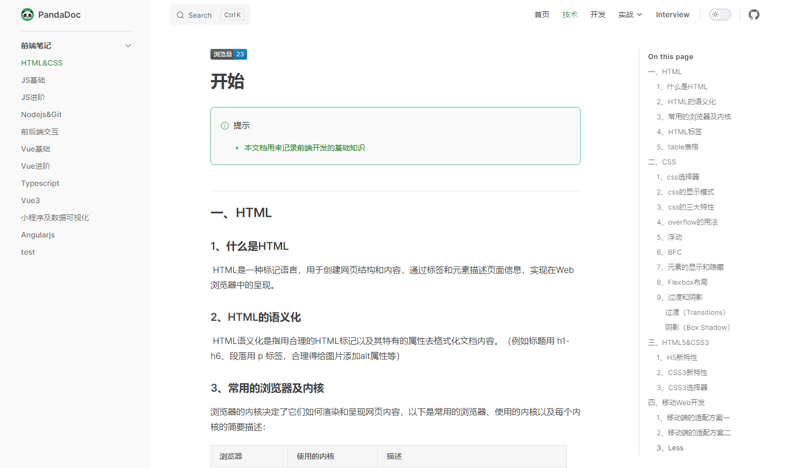

# pandaDoc

#### 介绍
欢迎来到[pandaDoc](https://fhguo.github.io/panda-doc/)—专为前端开发者打造的知识宝库与成长平台！无论你是编程世界的新手小白，还是寻求突破的进阶开发者，这里都是你理想的学习与交流空间。
- 访问地址：https://fhguo.github.io/panda-doc/
- 首页
  

- 内容
  


#### 软件架构

项目基于[VitePress](https://vitepress.dev/zh/)，VitePress 获取用 Markdown 编写的内容，对其应用主题，并生成可以轻松部署到任何地方的静态 HTML 页面。并且项目使用了vue3和[elementPlus](https://element-plus.org/zh-CN/)，可以更好的自定义页面内容。

#### 安装教程

> 提前安装运行环境[nodejs](https://nodejs.org/en)，版本号>=18

1. 安装

   ```bash
   # or pnpm or yarn
   npm install
   ```

2. 运行

   ```bash
   npm run dev
   ```

3. 打包

   ```bash
   npm run build
   ```
   
   如果需要部署到服务器上，务必修改`config.js`文件中的`base`相对路径地址

#### 使用说明

1.  config文件配置项目，参照 [vitepress配置](https://vitepress.dev/zh/reference/site-config)
2.  在theme文件夹自定义主题
3.  public文件夹存放静态资源

#### 参与贡献

1.  Fork 本仓库
2.  新建 Feat_xxx 分支
3.  提交代码
4.  新建 Pull Request
